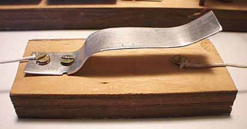

# Morse Code Virtual Radio

How to program your Raspberry Pi to send, recieve and decode Morse.


This year marks the 100th anniversary of the declaration of [World War 1](http://en.wikipedia.org/wiki/World_War_I). Over 16 million people lost their lives and 20 million suffered injuries making it one of the bloodiest conflicts in human history. It became known as the Great War and subsequently the First World War. War was declared on the 28th of July 1914. To commemorate this event we've come up with a way for you to simulate and experience the main form of radio communication that was used back then. Imagine being alive then and sending and receiving messages that could mean life and death using only tones!

*Note: This resources uses International Morse.*

## Lesson objectives

- Understand what Morse Code is
- Understand how Morse was used for communication
- Understand how to send and receive Morse
- Understand a pull up circuit
- Understand a pull down circuit
- Understand multithreading

## Lesson outcomes

- To have programmed the Raspberry Pi to create Morse Code tones
- To have sent and decoded messages in Morse Code
- Gained experience in Python programming
- Gained experience using the Raspberry Pi GPIO pins
- Gained experience in multithreaded programming

## Requirements

### Hardware

- Raspberry Pi
- Micro USB power adaptor
- An SD Card with Raspbian already set up through NOOBS
- USB keyboard
- USB mouse
- HDMI cable
- Ethernet cable
- LAN with Internet connection
- A monitor or TV
- **Male** to **Female** jumper wires, at least 2 (try [Pimoroni](http://shop.pimoroni.com/products/jumper-jerky))

### Software

- python-pygame

### Extras: A Morse Code key

A real Morse Code key will bring this project to life. Especially if you can acquire an antique one. These can often be found in local antique shops all over the country. Alternatively you can also buy one online, see the links below.

- Buy new online (try [nevada radio](http://www.nevadaradio.co.uk/amateur-radio/morse-keys/mfj-550))

  

- Find an antique (try [eBay](http://search.ebay.co.uk/antique+morse+code+key))

  Make sure it works!

  

- Make your own!

  

### Time required

- 2 to 3 hours

## Worksheet & included files

- [The worksheet](WORKSHEET.md)
- (Optional) Final version of Python code [final_code.py](./final_code.py)
    - Download to your Pi with
    ```bash
    wget https://raw.githubusercontent.com/raspberrypilearning/morse-code/master/morse_lookup.py --no-check-certificate
    wget https://raw.githubusercontent.com/raspberrypilearning/morse-code/master/final_code.py --no-check-certificate
    ```

## Licence

Unless otherwise specified, everything in this repository is covered by the following licence:


***Morse Code Virtual Radio*** by the [Raspberry Pi Foundation](http://raspberrypi.org) is licenced under a [Creative Commons Attribution 4.0 International License](http://creativecommons.org/licenses/by-sa/4.0/).

Based on a work at https://github.com/raspberrypilearning/morse-code
